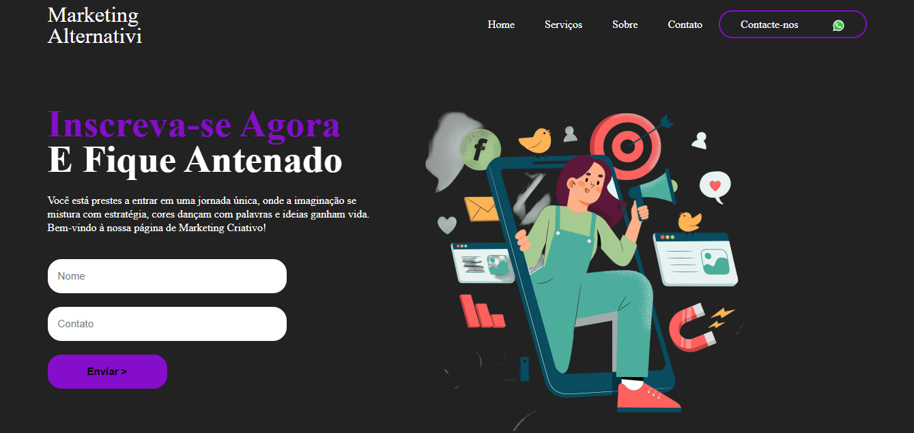

 Marketing Interativo

 
Landing page moderna e responsiva para a empresa Marketing Alternativi, focada na divulgação de estratégias de marketing digital, engajamento em redes sociais e construção de conexões duradouras com o público.

🚀 Visão Geral
Este projeto consiste em uma landing page estática desenvolvida para apresentar os serviços de uma agência de marketing. A página foi projetada com um visual criativo e interativo, utilizando uma paleta de cores escura com toques de roxo e verde-água, alinhada com a identidade visual da empresa.

O objetivo principal é capturar a atenção de potenciais clientes, apresentar os diferenciais da agência e incentivar o contato, tudo isso em um layout intuitivo e agradável.

✨ Funcionalidades
Design Responsivo: A página se adapta perfeitamente a diferentes tamanhos de tela, de desktops a dispositivos móveis.

Seção de Apresentação (Hero): Título chamativo e formulário de inscrição para captar leads.

Seção "Sobre": Apresentação da empresa, seus valores e diferenciais de forma estratégica e persuasiva.

Seção "Serviços": Cards visuais e interativos que detalham os principais serviços de marketing oferecidos.

Navegação Fluida: Menu de navegação com links âncora para uma experiência de usuário simplificada.

Formulário de Contato: Captura de informações de clientes interessados.

Integração com Redes Sociais: Botão direto para contato via WhatsApp.

🛠️ Tecnologias Utilizadas
O projeto foi construído utilizando as seguintes tecnologias:

HTML5: Estrutura semântica da página.

CSS3: Estilização, layout responsivo (Flexbox e Grid), e animações visuais.

JavaScript: Interatividade opcional, como animações de scroll e validação de formulário (não implementado neste exemplo, mas preparado para futura expansão).

Google Fonts: Tipografia moderna (Montserrat e Poppins) para um visual profissional.

Font Awesome: Biblioteca de ícones para enriquecer visualmente os cards e seções.

⚙️ Como Usar
Para visualizar ou modificar este projeto localmente, siga os passos abaixo:

Clone o repositório:

Bash

git clone https://github.com/seu-usuario/marketing-interativo.git
Navegue até o diretório do projeto:

Bash

cd marketing-interativo
Abra o arquivo index.html em seu navegador:
Basta dar um duplo clique no arquivo ou usar o comando:

Bash

open index.html
(Para usuários de macOS) ou

Bash

start index.html
(Para usuários de Windows)

📁 Estrutura de Arquivos
/marketing-interativo/
├── css/
│   └── style.css       # Folha de estilo principal
├── images/
│   └── (imagens e ilustrações)  # Diretório para imagens do projeto
├── index.html          # Arquivo principal da landing page
└── README.md           # Documentação do projeto
🤝 Contribuições
Contribuições, sugestões e melhorias são sempre bem-vindas! Se você tiver alguma ideia ou encontrar um bug, sinta-se à vontade para abrir uma issue ou enviar um pull request.

📝 Licença
Este projeto está licenciado sob a Licença MIT. Para mais detalhes, veja o arquivo LICENSE no repositório.
